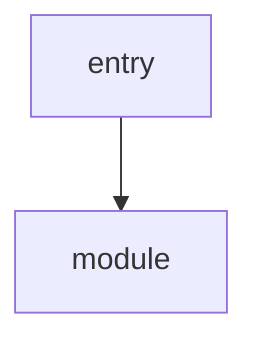
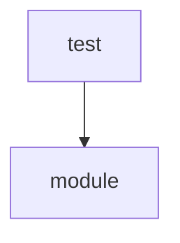

# <專案名稱> 函式呼叫關係圖

## 模組責任

| 模組 | 主要責任 |
| --- | --- |
| `<模組路徑>` | <主要責任> |

## 1. 啟動與關閉


```mermaid
flowchart TD
    A[entry] --> B[module]
```

## 2. 測試關係


```mermaid
flowchart TD
    T[test] --> B[module]
```

## 3. 未完成或未接線節點

| 節點 | 現況 |
| --- | --- |
| `<節點>` | <現況說明> |

執行測試：

```
<測試命令>
```
