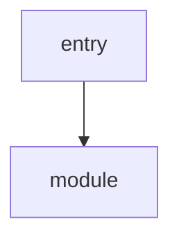
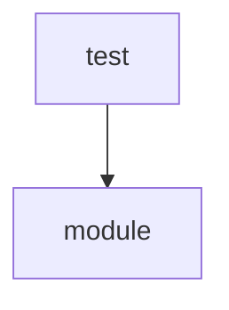

# <專案名稱> 架構圖

> **圖型不固定**：Agent 繪製前須評估內容性質，選擇最能表達該節的 mermaid 圖型（如 `flowchart`、`classDiagram`、`sequenceDiagram`、`stateDiagram-v2`、`erDiagram`），不得一律使用 flowchart。

## 模組責任

| 模組 | 主要責任 |
| --- | --- |
| `<模組路徑>` | <主要責任> |

## 1. 啟動與關閉

> 依本節內容選擇最合適的圖型（範例以 flowchart 示意）：



## 2. 測試關係

> 依本節內容選擇最合適的圖型（範例以 flowchart 示意）：



## 3. 未完成或未接線節點

| 節點 | 現況 |
| --- | --- |
| `<節點>` | <現況說明> |

執行測試：

```
<測試命令>
```
